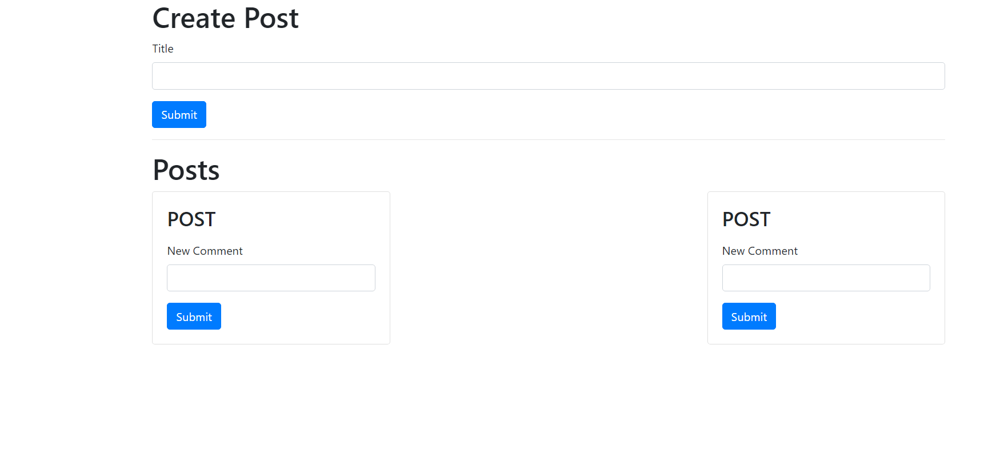

# Microservices 
- Build, deploy, and scale an E-Commerce app using Microservices built with Node, React, Docker and Kubernetes

- [microservices-with-node-js-and-react](https://www.udemy.com/course/microservices-with-node-js-and-react/)

- given /exercise_files

## Table of contents

- [Section 01 - Fundamental Ideas Around Microservices (46min)](#section-01---fundamental-ideas-around-microservices-46min)
- [Section 02 - A Mini Microservices App (3hr35min)](#section-02---a-mini-microservices-app-3hr35min)
- [Section 03 - Running Services with Docker (30min)](#section-03---running-services-with-docker-30min)
- [Section 04 - Orchestrating Collections of Services with Kubernetes (3hr25min)](#section-04---orchestrating-collections-of-services-with-kubernetes-3hr25min)
- [Section 05 - Architecture of Multiservice Apps (1hr6min)](#section-05---architecture-of-multiservice-apps-1hr6min)
- [Section 06 - Leveraging a Cloud Environment for Development (47min)](#section-06---leveraging-a-cloud-environment-for-development-47min)
- [Section 07 - Response Normalisation Strategies (1hr58min)](#section-07---response-normalisation-strategies-1hr58min)
- [Section 08 - Database Management and Modeling (1hr27min)](#section-08---database-management-and-modeling-1hr27min)
- [Section 09 - Authentication Strategies and Options (2hr48min)](#section-09---authentication-strategies-and-options-2hr48min)
- [Section 10 - Testing Isolated Microservices (1hr22min)](#section-10---testing-isolated-microservices-1hr22min)
- [Section 11 - Integrating a Server Side Rendered React App (3hr01min)](#section-11---integrating-a-server-side-rendered-react-app-3hr01min)
- [Section 12 - Code Sharing and Re-use Between Services (52min)](#section-12---code-sharing-and-re-use-between-services-52min)
- [Section 13 - Create-Read-Update-Destroy Server Setup (2hr28min)](#section-13---create-read-update-destroy-server-setup-2hr28min)
- [Section 14 - NATS Streaming Server - An Event Bus Implementation (2hr57min)](#section-14---nats-streaming-server---an-event-bus-implementation-2hr57min)
- [Section 15 - Connecting to NATS in a Node.js World (1hr22min)](#section-15---connecting-to-nats-in-a-nodejs-world-1hr22min)
- [Section 16 - Managing a NATS Client (1hr37min)](#section-16---managing-a-nats-client-1hr37min)
- [Section 17 - Cross-Service Data Replication in Action (2hr44min)](#section-17---cross-service-data-replication-in-action-2hr44min)
- [Section 18 - Understanding Event Flow (30min)](#section-18---understanding-event-flow-30min)
- [Section 19 - Listening for Events and Handling Concurrency Issues (4hr13min)](#section-19---listening-for-events-and-handling-concurrency-issues-4hr13min)
- [Section 20 - Worker Services (1hr36min)](#section-20---worker-services-1hr36min)
- [Section 21 - Handling Payments (2hr40min)](#section-21---handling-payments-2hr40min)
- [Section 22 - Back to the Client (1hr43min)](#section-22---back-to-the-client-1hr43min)
- [Section 23 - CI/CD (2hr17min)](#section-23---cicd-2hr17min)
- [Section 24 - Basics of Docker (3hr3min)](#section-24---basics-of-docker-3hr3min)
- [Section 25 - Basics of TypeScript (5hr42min)](#section-25---basics-of-typescript-5hr42min)
- [Section 26 - Bonus (1min)](#section-26---bonus-1min)

---

## Section 01 - fundamental ideas around Microservices (46min)

- each feature gets its own `service` (database)

### Database-per-service

- services do NOT directly access other services database (database-per-service pattern)
  - services can run independently of other services (reliability (single point of failure): db failure -> all fail, and difficult to scale (seperate db so only scale what is needed))
  - database schema changes wont affect other services
  - some services run better on different type of db (eg mongo vs sql)

### communication strategies between services

- sync
- async

#### sync

- pros -> service D wont need a database
- cons -> dependency between services (only as fast as slowest service)
- cons -> failure causes overall failure

#### async

- async communication with events (event bus handles events)
  - method 1:
    - services connect to event bus (single point of failure) and create/receive events (event type + data) which pass-on to/from event bus
    - has the downsides of synchronous communication + additional problems
  - method 2 (the way we will use it):
    - services emit events when something happens (picked up by db of service)
    - simultaneously an event is emitted to event bus (broadcast to anyone listening for specific event) -> event picked up by service D's created database (which is combination of all required data required by service D)
    - pros - service D will have 0 dependencies on other services
    - pros - fast
    - cons - duplicate data

---

## Section 02 - a mini microservices app (3hr35min)

### 11. App overview

- App: Blog post (allow users to make posts (titles) and others can add comments)

- `src/blog-boilerplate` boiler plate code for Sections 2, 3, and 4
- download:

  - [Docker desktop](www.docker.com) - containerization software
  - [Skaffold](https://skaffold.dev/) - Skaffold handles the workflow for building, pushing and deploying your application
  - [Postman](https://www.postman.com/) - testing api

- NOTE: if \_lock files given, use that..to ensure same package versions -> ie. use whatever given project files use, eg. npm, yarn or pnpm
- NOTE: DO NOT USE THIS PROJECT AS A TEMPLATE FOR FUTURE MICROSERVICES -> WILL HAVE A BETTER TEMPLATE TO USE
- TODO: we are creating a site that allows creating posts (title) and allow comments on the post. there is comment counter

- resources that will need services
  - posts service
  - comments service (tied to a post)
- determine the responsibility of each service

### 12. project setup

- react app -> src/client
- posts -> src/posts
  - express
  - cors
  - axios
  - nodemon
- comments -> src/comments
  - express
  - cors
  - axios
  - nodemon

### 13. express-based project for `Posts` service

- create a post (/POST) POSTMAN -> body: {title:string}
- list all posts (/GET)
- the use of an object `posts` to store new posts
- when creating a new post generate a random id (randomBytes) and convert to hex `.toString('hex')`
- when user sends json data, `bodyParser` ensures data gets parsed as json

```js
//src/posts/index.js
import express from "express";
import bodyParser from "body-parser";
import { randomBytes } from "crypto";

const app = express();
app.use(bodyParser.json());

const posts = {};

app.get("/posts", (req, res) => {
  res.send(posts);
});

app.post("/posts", (req, res) => {
  const id = randomBytes(4).toString("hex");
  const { title } = req.body;

  posts[id] = {
    id,
    title,
  };

  res.status(201).send(posts[id]); //201 - resource created
});

app.listen(4000, () => {
  console.log("Listening on 4000");
});
```

### 14. testing post service

- using POSTMAN
- POST -> `http://localhost:4000/`
  -> body -> RAW -> JSON -> {"title":string}
  -> Headers -> Content-Type -> application/json

- GET -> `http://localhost:4000/`
  -> Headers -> Content-Type -> application/json

### 15. express-based project for `Comments` service

- create a comment (tied to a post)
- list all comments (comments related to a specific post)
- Use a different port to `posts`
- `:id/comments` -> comments of an id (array of objects)
- `req.params.id` access id param in url

```js
//src/comments/index.js
import express from "express";
import bodyParser from "body-parser";
import { randomBytes } from "crypto";

const app = express();
app.use(bodyParser.json());

const commentsByPostId = {};

app.get("/posts/:id/comments", (req, res) => {
  res.send(commentsByPostId[req.params.id] || []);
});

app.post("/posts/:id/comments", (req, res) => {
  const commentId = randomBytes(4).toString("hex");
  const { content } = req.body;

  const comments = commentsByPostId[req.params.id] || [];

  comments.push({ id: commentId, content });

  commentsByPostId[req.params.id] = comments;

  res.status(201).send(comments);
});

app.listen(4001, () => {
  console.log("Listening on 4001");
});
```

### 16. testing comments

- POSTMAN
- POST -> `http://localhost:4001/123/comments`
  -> Headers -> Content-Type -> application/json
  -> body -> RAW -> JSON -> {"content":"I am a comment"}

- GET -> `http://localhost:4001/`
  -> Headers -> Content-Type -> application/json

### 17-25. react app

- react app to use the microservices
- App -> PostCreate
- App -> PostList
- App -> PostList -> CommentList
- App -> PostList -> CommentCreate

```js
//src/index.js
import React from "react";
import ReactDOM from "react-dom/client";
import App from "./App";

const root = ReactDOM.createRoot(document.getElementById("root"));
root.render(<App />);
```

- note: public/index.html
- add bootstrap cdn:

```html
<!-- ... -->

<link
  rel="stylesheet"
  href="https://stackpath.bootstrapcdn.com/bootstrap/4.3.1/css/bootstrap.min.css"
  integrity="sha384-ggOyR0iXCbMQv3Xipma34MD+dH/1fQ784/j6cY/iJTQUOhcWr7x9JvoRxT2MZw1T"
  crossorigin="anonymous"
/>

<!-- ... -->
```

- PostCreate -> has a form with `onSubmit` that posts to localhost:4000 (posts)
- form handler has `event.preventDefault();`

```js
await axios.post("http://localhost:4000/posts", {
  title,
});
```

### 21. CORS ERRORS

- cors requests errors -> anytime we try access a domain/port or subdomain that is different from the url we are trying to make request to.
- eg. localhost:3000 trying to access localhost:4000
- localhost:4000 has to configure the server to allow cors

```
npm i cors
```

```js
import cors from "cors";

//...
const app = express();
app.use(bodyParser.json());
app.use(cors());
```

### 22. fetching and rendering posts

- src/client/App.js

```js
//client/src/App.js

import React from "react";
import PostCreate from "./PostCreate";
import PostList from "./PostList";

const App = () => {
  return (
    <div className="container">
      <h1>Create Post</h1>
      <PostCreate />
      <hr />
      <h1>Posts</h1>
      <PostList />
    </div>
  );
};
export default App;
```

### 23. creating comments

- client/src/CommentCreate.js
- CommentCreate needs to know the id of the post

```js
const CommentCreate = ({ postId }) => {};
```

### 24. displaying comments

- client/src/CommentList.js

```js
//client/src/CommentList.js

import React, { useState, useEffect } from "react";
import axios from "axios";

const CommentList = ({ postId }) => {
  const [comments, setComments] = useState([]);

  const fetchData = async () => {
    const res = await axios.get(
      `http://localhost:4001/posts/${postId}/comments`
    );

    setComments(res.data);
  };

  useEffect(() => {
    fetchData();
  }, []);

  const renderedComments = comments.map((comment) => {
    return <li key={comment.id}>{comment.content}</li>;
  });

  return <ul>{renderedComments}</ul>;
};

export default CommentList;
```

### 26. request minimization strategies

- PROBLEM -> we are making one request (for posts' comments) for every post we have fetched
- REQUIRED -> a single request for post AND also all associated comments

### 27. async solution

- post service (emits an event when a post is created) -> event broker (receives events sends them to interested parties)
- comments service (emits an event when a comment is created) -> event broker (receives events sends them to interested parties)
- NEW: queries service (listens for when post or comment is created - assembles all blogs and comments into efficient data structure)

### The Queries service

- the queries service listens for new post and comment events and takes information it needs
- CONS - is that there is data duplication
- PROS - faster / less dependencies

### 29. Event Bus overview

- there are different implementations of event bus: RabbitMQ, Kafka, NATS
- what they do? they receive events then publishes them to listeners
- these implementations have subtle differences that make async communication easier or harder
- TODO: express based event bus
  - Post service -> POST /events ( localhost:4000/events)
  - Comments service -> POST /events ( localhost:4001/events)
  - Query service -> POST/events ( localhost:4002/events)
- Event bus (port :4005) receive events from `post` OR `comments` OR `query` and send the same event to the services (\*including the sender)

### 30. node and unhandled promise rejections
- NOTE: Unhandled Promise Rejections are now treated as errors instead of warnings and will cause the servers to crash.
- FIX: you'll need to add a catch block to every request of the event-bus/index.js

```js
  //POSTS: 4000
  axios.post("http://localhost:4000/events", event).catch((err) => {
    console.log(err.message);
  });
  
  //COMMENTS: 4001
  axios.post("http://localhost:4001/events", event).catch((err) => {
    console.log(err.message);
  });
  
  //QUERY: 4002
  axios.post("http://localhost:4002/events", event).catch((err) => {
    console.log(err.message);
  });

  res.send({ status: "OK" });
```

### 31. basic event bus implementation
- event-bus/
- as described, event bus has event handler for post /events, when it receives this (req.body), it will make calls to 
  - post /events, sending the event
  - comments /events, sending the event
  - query /events, sending the event

### 32. emmiting events (post service)
- event-bus/src/index.js is running..
- posts/src/index.js sends event

```js
//posts/src/index.js

//...

  await axios.post('http://localhost:4005/events', {
    type:'PostCreated',
    data:{
      id, title
    }
  });

//...
```

### 33. emiting events (comment event)
- comments/src/index.js

```js
  //...

  await axios.post('localhost:4005/events', {
    type: 'CommentCreated',
    data: {
      id: commentId,
      content,
      postId: req.params.id
    }
  })
```

### 34. receiving events
- the services need to be able to receive events (listen for events from app)
- NOTE: if you test (client), all 4 services need to be running (comments, event-bus, posts, client)

```js
//posts/index.js
app.post('/events', (req, res)=>{
  console.log('received event: ', req.body.type);

  res.send({});
});

```

```js
//comments/index.js
app.post('/events', (req, res)=>{
  console.log('received event: ', req.body.type);

  res.send({});
});

```

### 35. Data query service
- /query/index.js
- service which allows listing of post with its comments
- query service will not emit events (no need for axios)
- route handlers for query service:
  - GET /posts (posts + comments)
  - POST /events (receive events type "CommentCreated" and "PostCreated")

### 36. parsing incoming events
- query/index.js
- events of type `PostCreated` and events of type `CommentCreated`:

```js
if (type === 'PostCreated') {
  const { id, title } = data;
  posts[id] = { id, title, comments: [] };
}

if (type === 'CommentCreated') {
  const { id, content, postId } = data;
  const post = posts[postId];
  post.comments.push({ id, content });
}
```

- example of `posts` object
```js
posts === {
  'ghgu443': {
    id: 'ghgu443',
    title : "post title",
    comments: [
      {
        id: 'klfjfs3',
        content: "comment!"
      }
    ]
  },
  'ghgsad12': {
    id: 'ghgu443',
    title : "post title",
    comments: [
      {
        id: 'klfjfs3',
        content: "comment!"
      }
    ]
  }
}
```

```js
//query/index.js
import express from 'express';
import bodyParser from 'body-parser';
import cors from 'cors';

const app = express();
app.use(bodyParser.json());
app.use(cors());

const posts = {};

app.get('/posts', (req, res) => {
  res.send(posts);
});

app.post('/events', (req, res) => {
  const { type, data } = req.body;

  if (type === 'PostCreated') {
    const { id, title } = data;

    posts[id] = { id, title, comments: [] };
  }

  if (type === 'CommentCreated') {
    const { id, content, postId } = data;

    const post = posts[postId];
    post.comments.push({ id, content });
  }

  console.log(posts);

  res.send({});
});

app.listen(4002, () => {
  console.log('Listening on 4002');
});


```

### 37. using query service
- TODO: client (react app) for reading data -> swop out reaching to `Posts service` and `Comments service` and get data directly from `query service` :4002
- this means client/src/PostList.js will hit the query service at port 4002
```js
const fetchPosts = async () => {
  const res = await axios.get("http://localhost:4002/posts");

  setPosts(res.data);
};
```

- this means CommentList wont send another query (it was depending on postId to fetch all comments of a post)
```js
<CommentList comments={post.comments} />
```

### 38. simple feature
- adding a feature: idea of comment moderation (filtering comments eg. with "orange" word) 
- comments get "status" property: `pending` (awaiting moderation), `approved`, `rejected` 
- assuming moderation will take some time

### 39. issues with commenting filter
#### Option 1 - Moderation communicates event creation to query service (CURRENT DESIGN)
- user submits comment 
1. comment service persists the data and submits `CommentCreated` event (to event bus)
2. event bus then sends event to all services (including moderation service)
3. moderation service has to complete  before it returns a message ( type `CommentModerated` -> status (eg `approved`)) to event Bus
4. event bus then sends ( type `CommentModerated` -> status (eg `approved`)) event all services of app (including query service)
- PROBLEM: the problem is moderation is not instant and can take time (eg if human required to moderate), design like this everything stops until moderation step is complete

### 40. Option 2
#### Option 2 - Moderation updates status at both comments AND query services
1. comment service persists the data and submits `CommentCreated` event (to event bus)
2. event bus then sends event to all services (including moderation service) 
  * AND query service (where the event will be processed and persisted default status: `pending`) while it waits for moderation
3. moderation service has to complete  before it returns a message ( type `CommentModerated` -> status (eg `approved`)) to event Bus
4. event bus then sends ( type `CommentModerated` -> status (eg `approved`)) event all services of app (including query service)
5. query service updates its status to "approved"
- PROBLEM: the query service itself shouldnt need to understand "HOW TO" update a service. 
- PROBLEM: because as more and more resources are added, they might have to all update data, (eg. if these other services also have to handle `comments`, then they will all need to handle all the different scenarios in the service too) 

### 41. Option 3 - query service only listens for update events (advised implementation method)
- so now the correct way is for the moderation to happen inside the `comments service` itself. it handles all logic around a comment (how to handle and update a comment)
- FIX: use a generic event (`CommentUpdated`) for all the various events being handled inside Comment service
- eg. emit same event type `CommentUpdated` for all event types: CommentModerated, CommentUpvoted, CommentDownvoted, CommentPromoted, CommentAnonymized, CommentSearchable, CommentAdvertised
- so the steps are the same as OPTION 2, BUT.. 
- step 4. the comment service handles and processes all comment related events.
- because comment service made an update to a comment a generic event `CommentUpdated` is emitted and sent to event Bus
- event bus sends event off to query service
- query updates itself with new prop values
- SOLUTION: in this solution, the query service only needs to know about `CommentUpdated` event.

### 42. moderation service
#### CREATE: moderation service
- the moderation service will watch for events
- RECEIVE from EventBus -> `CommentCreated` at `/events`
- ... then later Moderation service needs to SEND out `CommentModerated` event.

```js
//blog/moderation/index.js
import axios from 'axios';
import express from 'express';
import bodyParser from 'body-parser';
const app = express();
app.use(bodyParser.json());

app.post('/events', (req, res)=>{

})

app.listen(4003, ()=>{
  console.log('listening on 4003');
});
```

### 43. adding comment moderation
#### UPDATE: comment service, query service
- update Comment service so comments have 'status' property -> `comments.push({ id: commentId, content, status: 'pending' });`
- emit event -> `CommentCreated` event -> event bus

```js
//blog/comments/index.js
//comment sending to event bus (port: 4005)
//...

await axios.post('http://localhost:4005/events', {
  type: 'CommentCreated',
  data: {
    id: commentId,
    content,
    postId: req.params.id,
    status: 'pending'
  }
})

```
- event bus sends event to `moderation service` AND `query service`
- the query service immediately processes (stores) the comment 

```js
//blog/query/index.js
//...
app.post('/events', (req, res) => {
  //...

  if (type === 'CommentCreated') {
    const { id, content, postId, status } = data;   //includes 'status'
    const post = posts[postId];
    post.comments.push({ id, content, status });
  }
});
```

### 45. Handling moderation
- after comment event is received by event bus, it should be sent to moderation service as well

```js
//blog/event-bus/index.js
//...

app.post("/events", (req, res) => {
  const event = req.body;

  //...

  //MODERATION :4003
  axios.post("http://localhost:4003/events", event).catch((err) => {
    console.log(err.message);
  });

  res.send({ status: "OK" });
});

//...
```

- the moderation service should look at `CommentCreated` event's 'content' and check (filter)
- the moderation service should emit `CommentModerated` with status `approved` OR `rejected`
- the event will be on req.body: `const {type, data} = req.body`
- the moderation service will post an `CommentModerated` event to `event bus`.

```js
//blog/moderation/index.js
import axios from "axios";
import express from "express";
import bodyParser from "body-parser";

const app = express();
app.use(bodyParser.json());

app.post("/events", async (req, res) => {
  //req.body will contain event
  const { type, data } = req.body;

  if (type === "CommentCreated") {
    const status = data.content.includes("orange") ? "rejected" : "approved";

    await axios.post("https://localhost:4005/events", {
      type: "CommentModerated",
      data: {
        id: data.id,
        postId: data.postId,
        status,
        content: data.content,
      },
    });
  }
  res.send({});
})
.catch((err) => {
  console.log(err.message);
});

app.listen(4003, () => {
  console.log("listening on 4003");
});

```
### 46. updating comment content
- in the comment service (after event bus sends `CommentModerated` event), comment service should update `status`
- after updating "status", tell other applications by emit `CommentUpdated` event (status should be `approved` or `rejected`)

```js
//blog/comments/index.js
const commentsByPostId = {};

app.post('/events', async (req, res)=>{
  console.log('received event: ', req.body.type);

  const {type, data} = req.body;

  if(type === 'CommentModerated'){  
    const {postId, id, status, content} = data;

    //find the comments by postId
    const comments = commentsByPostId[postId];

    //find comment in comments
    const comment = comments.find(comment => {
      return comment.id === id;
    })

    //update comment status
    comment.status = status;

    //send CommentUpdated event to event bus
    await axios.post(`http://localhost:4005`, {
      type: 'CommentUpdated',
      data: {
        id,
        status,
        postId,
        content
      }
    })
  }
  
  res.send({});
});

//...
```

### 47. query service listens for CommentUpdated
```js
//blog/query/index.js
//...

  if(type === 'CommentUpdated'){
    const {id, content, postId, status} = data;
    const post = posts[postId];
    
    const comment = post.comments.find(comment => {
      return comment.id === id;
    });
    
    //update the actual content
    comment.status = status;
    comment.content = content;
  }

//...
```
### 48. rendering comments by status
- we update CommentList so that it renders the comments differently depending on its status
- client/src/CommentList.js
- if its rejected or pending show something else (not the li element)
- NOTE: to test `pending` status, shutdown the `moderation/ service` (port:4003)
- NOTE: if the moderation service was down while the event bus attempted to send an event to it, the event would be lost
- FIX: deal with the missing events (see lesson 49.)

```js
import React from "react";

const CommentList = ({ comments }) => {

  const renderedComments = comments.map((comment) => {
    let content;

    if(comment.status === 'approved'){
      content = comment.content;
    }

    if(comment.status === 'pending'){
      content = 'comment awaiting moderation';
    }

    if(comment.status === 'rejected'){
      content = 'this comment has been rejected';
    }

    return <li key={comment.id}>{content}</li>;
  });

  return <ul>{renderedComments}</ul>;
};

export default CommentList;

```

### 49. missing events
- if the moderation service was down when event bus submitted the event to it
- what if the `query service` only created at a later stage? syncing?

#### option 1: sync requests
- syncing by requesting -> code to get all older posts AND comments
- CONS - syncronous requests...
- CONS - need code (endpoints) to get posts and comments

#### option 2: direct DB access
- direct db access (query service has direct access to posts and comments db)
- CONS - the logic to connect to db needs to be written

#### option 3 (preferred method): store events (Event bus data store)
- example: query service comes online later stage, it can work if it has access to past events..
- TODO: when ANY service emits event to event bus, the event is sent to all services BUT `event Store` also stores the event
- at a later stage, Query service can request past events from `Event bus data store` and check what the last successful event stored was and catchup missing events

### 51. implementing event sync
- TODO: implement option 3 
  - ie. stop query service
  - create some posts + comments (query service sends event out -> event-bus should store the event)
  - create an end-point to retrieve all events that have occured (event data stoe)
  - then launch query service -> make sure it can get events from `event bus data store`
  - when query service starts listening on port 4002, it should get list of all events that have been emitted from event-bus

```js
//src/event-bus/index.js

const events = [];
app.post("/events", (req, res) => {
  const event = req.body;
  events.push(event);
  //...
});

app.get('/events', (req, res)=>{
  res.send(events);
});
```

```js
//query/index
import express from 'express';
import bodyParser from 'body-parser';
import cors from 'cors';

const app = express();
app.use(bodyParser.json());
app.use(cors());

const posts = {};
/*:

//example of post 
post === {
  'ghgu443': {
    id: 'ghgu443',
    title : "post title",
    comments: [
      {
        id: 'klfjfs3',
        content: "comment!"
      }
    ]
  }
}
*/

const handleEvent = (type, data) => {
  if (type === 'PostCreated') {
    const { id, title } = data;
    posts[id] = { id, title, comments: [] };
  }

  if (type === 'CommentCreated') {
    const { id, content, postId, status } = data;
    const post = posts[postId];
    post.comments.push({ id, content, status });
  }

  if(type === 'CommentUpdated'){
    const {id, content, postId, status} = data;
    const post = posts[postId];
    const comment = post.comments.find(comment => {
      return comment.id === id;
    });
    //update the actual content
    comment.status = status;
    comment.content = content;
  }
}


app.get('/posts', (req, res) => {
  res.send(posts);
});

app.post('/events', (req, res) => {
  const { type, data } = req.body;
  handleEvent(type, data);
  res.send({});
});

app.listen(4002, async () => {
  console.log('Listening on 4002');

  const res = await axios.get('http://localhost:4005/events');
  for(let event of res.data){
    console.log('processing event', event.type);
    handleEvent(event.type, event.data);
  }
});

```

### summary
- Microservices architecture involves breaking down an application into smaller, independent services that communicate over well-defined APIs. 
- This approach enhances reliability, scalability, and maintainability by allowing teams to develop, deploy, and scale services independently. 
- It also promotes data encapsulation and efficient event-driven communication, reducing the need for excessive server calls.

## Section 03 - running services with docker (30min)

### 53. deployment issues
- WE HAVE: 
  - services (each its own app with port)
  - each service can access each others service via `event Bus`
  - how to deploy? rent a virtual machine (transfer apps to it)
    - with virtual machine you can spin up addtional services (eg. comment service 1,2,3) on `load balancer` on the virtual machine
      - CONS - new service requires additional ports which need to be added and assigned in `Event Bus`.
    - but you can also spread the service across additional virtual machine
      - CONS - if its on a different virtual machine, need to access its `IP address` instead of `localhost`
- FIX: we need to find a way to keep track of all services running in application

### 54. docker
- NOTE: [Section 24 - Basics of Docker (3hr3min)](#section-24---basics-of-docker-3hr3min)
- docker uses containers (isolated computing environment - contains everything required to run an app)
- each docker container runs a service
- additional copies of a service -> spins up additional docker container
- Docker solves the assumptions made about environment (eg. assumption npm is installed and node is installed)
- assumption user knows startup commands to run app

### 55. kubernetes
- kubernetes is used to run a bunch of containers together (via configuration files)

  #### cluster
  - kubernetes cluster is a set of virtual machines (with varying amounts of virtual machines) AKA nodes
  - the services in the nodes still communicate with the `Event bus`
  - requests are handled by a `common communcation chanel` in the cluster -> it figures out how and where to send events

  #### Master
  - a `master` - manages everything in the cluster (these virtual machines)

  #### Config
  - the configuration includes instructions on how to run the service -> which is passed to master

### 56. dont know docker? 
- see [Section 24 - Basics of Docker (3hr3min)](#section-24---basics-of-docker-3hr3min)

### 57. notes about docker build output and buildkit
- TODO: building a Docker image of our Posts service
- the most recent versions of Docker will now have "Buildkit" enabled by default.
- buildkit docker build output:

```cmd
<!-- Now, with Buildkit, the final step would say: -->

 => => exporting layers                                                      
 => => writing image sha256:ee59c34ada9890ca09145cc88ccb25d32b677fc3b61e921  0.0s
 
```
#### Disabling Buildkit to match course
- Click the Docker Icon your systray
- Select "Preferences"
- Select "Docker Engine"

```
{
  "features": {
    "buildkit": false
  },
  "experimental": false
}
```
- Apply and Restart.

### 58. dockerizing the post service
- blog/posts/Dockerfile

#### Troubleshoot
note: it is `CMD ["npm", "start"]` NOT `CMD ["npm": "start"]`

```Dockerfile
# blog/posts/Dockerfile
FROM node:14-alphine

WORKDIR /app
COPY package.json ./
RUN npm install
COPY ./ ./

CMD ["npm", "start"]

```
- .gitignore -> the files/folders to ignore when building an image
- run docker eg. id of created image is `cddd85607be243e2b0dd28007520b223dc69477c2423f37663dfe3a2580a78ae`

```cmd
docker run cddd85607be243e2b0dd28007520b223dc69477c2423f37663dfe3a2580a78ae 
```


### 59. review some basic commands

- docker build -t docker-id/name-of-project .
- docker run docker-id/name-of-project
- docker run -it docker-id/posts sh
- docker ps
- docker exec -it container-id sh
- docker logs

- is going to remove all docker images that you have on your PC
`docker rmi $(docker images -a -q)`

- deletes deployment
`kubectl delete deployment <deployment_name>`

- is going to create an image without any pre-cached stuff. 
`docker build --no-cache -t <your_tag>/posts .` 

- pushes to docker image storage 
`docker push <your_tag>/posts`

- to recreate deployment. It is going to fetch new image from remote.
`kubectl apply posts-depl.yaml`

### list all docker images
- list all docker images: `docker images -a`

### deleting image by id
- `docker rmi -f <image_id>`

#### delete all images with tags `<none>`
- docker image prune

-If you want to remove all images with `<none>` tags in one go: 
- `docker rmi -f $(docker images -q -f "dangling=true")`


### 60. dockerizing the other services
- the other services in blog/ have the same node setup and command to start the service so you can copy+paste files from Post service:
  - .dockerignore (node_modules)
  - Dockerfile

#### test
```cmd
//event-bus/

docker build -t clarklindev/event-bus .
docker run clarklindev/event-bus
```

## Section 04 - orchestrating collections of services with kubernetes (3hr25min)

## 62. installing kubernetes
- Kubernetes -> tool for running a bunch of different containers
- give kubernetes configuration to instruct it how to run AND how to interact with each other

- Install option -> Docker for Windows / Mac /linux
  #### Windows -> enable kubernetes
  - RECOMMENDED -> Windows users should use -> Docker Desktop with WSL2
  - docker toolbox icon -> preferences -> kubernetes -> enable kubernetes -> restart

  #### mac 
  - RECOMMENDED -> macOS users should use Docker Desktops kubernetes instead of Minikube

  #### Linux
  - RECOMMENDED -> Minikube 

## 63. NOTE on MiniKube
- Install option -> Install method with Docker-Toolbox (STATUS: unstable) or Linux (need to install [minikube](kubernetes.io/docs/tasks/tools/install-minikube))
  - Minikube is an alternative option to using Docker Desktop's built-in Kubernetes.

## 64. kubernetes tour
- NOTE: make sure Docker is running (NOT AS ADMINISTRATOR but normal user)
- NOTE: for me, windows 11 kubernetes option from docker-desktop took a while to startup
```
kubectl version
```

```cmd out
PS C:\Users\laptop> kubectl version
Client Version: v1.30.2
Kustomize Version: v5.0.4-0.20230601165947-6ce0bf390ce3
Server Version: v1.30.2
```
- Docker-desktop -> you should see 'kubernetes running' (status bar)  


### TROUBLESHOOT
```
PS C:\Windows\system32> kubectl version
Client Version: v1.30.2
Kustomize Version: v5.0.4-0.20230601165947-6ce0bf390ce3
Unable to connect to the server: dial tcp [::1]:8080: connectex: No connection could be made because the target machine actively refused it.
```
#### Windows
- `kubectl config get-contexts` -> `kubectl config use-context docker-desktop`
- on Windows 11 -> from Q&A -> The only thing that worked for me was while in Docker Desktop I clicked on the "Troubleshoot" bug icon at the top. Then clicked the "Clean / Purge data" button. In the pop-up I selected all three check boxes ("Hyper-V", "WSL 2", "Windows Containers") and clicked the "Delete" button. After it completed Docker and Kubes status both went green.
- deleted the .kube folder in my user directory
- Delete the folder (hidden folder) `C:\ProgramData\DockerDesktop\pki` OR `C:\Users\<user_name>\AppData\Local\Docker\pki`
- update kube config file `c:\Users\<user folder>\.kube\config` -> update clusters server -> `server: https://localhost:6443`
- AS ADMINISTRATOR: c:\Windows\System32\drivers\etc\hosts

```
127.0.0.1 kubernetes.docker.internal
127.0.0.1 docker-for-desktop
```

#### Docker desktop for mac
- [Q&A](https://www.udemy.com/course/microservices-with-node-js-and-react/learn/lecture/19099722#questions/10956202) - By default, the server address for the cluster in the kube config file is set to `https://kubernetes.docker.internal:<port number>`. For Docker Desktop for Mac version 2.3.0.3 and K8s version 1.16.5, this server address needs to be changed to `https://localhost:<port number>`, where the port number is usually something like 6443. Once I made this change to the server address, I was finally able to connect to the local kube server and use the kubectl command without any issues.
- kubernetes takes the docker image created and `deploys` and `manages` this instance of image (as a container) in the kubernetes cluster (node -> Virtual Machine)
- a config file for kubernetes -> tells it how to manage the image and host it as container in `kubernetes cluster of nodes`
- config also describes the access rights
- `kubectl` is tool used to interact with the kubernetes cluster
- kubernetes tries to find the image (described in config file) first from local computer
- if it cant find it, then it looks in docker-hub 

#### terminology
- NOTE: a `pod` OR `container` by definition is more or less the same thing. 
  - pod -> wraps a container
  - pod -> can have multiple containers inside of it
- Deployment -> kubernetes creates a `deployment` to manage the containers (pods) 
  - it takes in the config file
  - makes sure correct number of pods 
  - and makes sure they are running
- Kubernetes service -> gives access to running pods/containers (via easy url) -> manages access of these pods (microservices) to other nodes in the kubernetes cluster
  - ie. other services in kubernetes cluster reach out to the service instead of directly accessing other pods

### 65. summary of kubernetes terminology


### 66. kubernetes config file
- the config file kubernetes uses to create (pods, services, deployments)
- (pods, services, deployments) are collectively known as `Objects`
- written in YAML
- always store these config with project source code (they are documentation)
- NOTE: you can create `objects` without config file - BUT DONT DO THIS..
  - unless its only for testing purposes

### 67. - creating a pod
- we use `apply` command to create container in kubernetes cluster 
- NOTE: later we correct this and say `DEPLOYMENTS` manage pods in kubernetes cluster
- TODO: create a config file -> create a pod that runs a container from the `Posts service`
- NOTE: ensure Docker is running
- TODO: rebuild the docker image of posts (with version): `docker build -t clarklindev/posts:0.0.1 .` 

```cmd out
 => => exporting layers 0.3s 
 => => writing image sha256:1dbeadbb183283db3ceee72c451ea79f3e83d33ab384292d7b60c62e74c1b734 0.0s 
 => => naming to docker.io/clarklindev/posts:0.0.1 0.0s 
```
- TODO: create the directories in project folder: `infra/k8s` infrastructure
- NOTE: `k8s` short for kubernetes 
- TODO: create a posts.yaml file (NOTE: indentation is important in YAML)

```yaml
# blog/infra/k8s/posts.yaml

apiVersion: v1
kind: Pod
metadata:
  name: posts
spec:
  containers:
  - name: posts
    image: clarklindev/posts:0.0.1
    resources:
      limits:
        memory: "128Mi"
        cpu: "500m"

```
- tell kubernetes to use this config file
- go to k8s folder -> tell kubernetes to use this config file:
- note: .yaml (call apply with file name and file extension)

```cmd
//blog/infra/k8s/
kubectl apply -f posts.yaml
```
- should get: `pod/posts created`.
- NOTE: later we use deployments (posts-depl.yaml)

### look at pods running inside cluster

```cmd
kubectl get pods
```

### 69. PODS - understanding pod specs
- note: the `-` dash under `containers` means its an array (so there could be more containers added)
- note: `name` can be anything you decide
- NOTE: spec -> `image` if you specify `:latest` or dont specify, it assumes to fetch from docker-hub, if you specify version, will first check local computer for the image.


### 70. common kubectl commands
- just as Docker has its own commands, Kubectl is commands for containers

- `kubectl apply -f posts.yaml`
- `kubectl exec -it posts sh`
- `kubectl delete pod posts`
- `kubectl get pods`
- `kubectl describe pod [podname]` -> look at events inside pod

### 71. kubectl alias

#### Powershell
- to create an alias, open powershell -> `$PROFILE`
-` C:\Users\<user>\Documents\WindowsPowerShell\Microsoft.PowerShell_profile.ps1`
- create profile if it doesnt exist: `New-Item -Path $PROFILE -ItemType File -Force` -> `C:\Users\<user>\Documents\WindowsPowerShell\Microsoft.PowerShell_profile.ps1`
- Open the Profile in a Text Editor: Use Notepad (or any text editor): `notepad $PROFILE`
- Add Your Aliases: In the opened profile file, add your Set-Alias commands. For example:

```
Set-Alias k Kubectl
```
- To apply the changes immediately without restarting PowerShell, run: `. $PROFILE`
- Verify Your Aliases -> `Get-Alias`

### 72. DEPLOYMENTS
- instead of creating pods directly in kubernetes cluster, we create a deployment
- deployment -> kubernetes object that manages a set of pods
- kubernetes Deployments job is:
  1. maintain the number of running pods specified
  2. deployment takes care of pod updates:

  #### update STEPS:
  1. create updated pods 
  2. replace old pod instances with updated 
  3. delete old pods

- you mainly use deployments by reading deployment logs

### 73. creating a deployment
- config file for deployment
- //blog/infra/k8s/posts-depl.yaml (note: `depl` stands for deployment)
- replicas -> number of pods to create running a particular image.
- NOTE: deployments have to figure out which pods it has to manage (`selector`, `metadata` help with this)
- selector -> look at all pods with label `x`
- template->metadata -> specify that pod will have label of `x`
- spec -> pod specs

```yaml
# blog/infra/k8s/posts-depl.yaml

apiVersion: apps/v1
kind: Deployment
metadata:
  name: posts-depl
spec:
  replicas: 1
  selector:
    matchLabels:
      app: posts
  template:
    metadata:
      labels:
        app: posts
    spec:
      containers:
      - name: posts
        image: clarklindev/posts:0.0.1

        resources:
          limits:
            memory: "128Mi"
            cpu: "500m"

```
- you can apply the posts-depl.yaml to the kubernetes cluster
- from blog/infra/k8s/ folder:
- create the pod...

```cmd
Kubectl apply -f posts-depl.yaml
```
- expect cmd status update `deployment.apps/posts-depl created`

### 74. common commands around deployments
- deployment commands  


- `kubectl get deployments`
- `kubectl get pods`
- `kubectl delete pod posts-depl-7f7567b88c-fmr2q`
  - if you delete a pod created by deployment, the deployment will re-create the pod
  - after pod deleted, if you run `kubectl get pods` again, you will see a new pod with different name eg. name `posts-depl-7f7567b88c-5nkbv`

  ```cmd out
  NAME                          READY   STATUS    RESTARTS       AGE
  posts                         1/1     Running   1 (3m3s ago)   4h18m
  posts-depl-7f7567b88c-5nkbv   1/1     Running   0              49s
  ```
- `kubectl describe deployment [depl name]` -> import part is `events`
- `kubectl apply -f [config file name]` -> deploy to kubernetes
- `kubectl delete deployment [depl name]` -> pods related to deployment are also deleted
- `kubectl delete pod posts` -> do not create pods manually/directly (if anything happens, you wont have way to start them back up)
  
### 75. updating deployments
#### METHOD 1 (PREFERED METHOD IS METHOD 2)
- NOTE: Method 2 is preffered because method 1 relies on updating the version number in config

#### STEPS 
1. make changes to project code
2. rebuild image (tag NEW image version): 
  ```cmd
  //blog/posts/
  docker build -t clarklindev/posts:0.0.5 .
  ```
3. in deployment config -> update version of the image
  ```yaml
  <!-- blog/infra/k8s/posts-depl.yaml -->
  
  <!-- ... -->

  spec:
    containers:
      - name: posts
        image: clarklindev/posts:0.0.5 
  ```


4. tell kubernetes to use this updated file:
- `kubectl apply -f [depl file name]`
  ```cmd
  //infra/k8s/
  kubectl apply -f posts-depl.yaml
  kubectl get deployments
  kubectl get pods
  kubectl logs posts-depl-7488f87775-vph87

  ```
### 76. preferred deployment method
#### METHOD 2
- tells kubernetes to automatically get the latest version
1. the deployment ALWAYS uses the `latest` tag in pod `spec` section (or image version should be omitted)

```yaml
//blog/infra/k8s
# ...

    spec:
      containers:
      - name: posts
        image: clarklindev/posts:latest

# ...
```
- need to apply it to kubernetes cluster to let it know to use latest image
- blog/infra/k8s -> `kubectl apply -f posts-depl.yaml`
- `kubectl get deployments`

2. make an update to your code

3. rebuild the image 
```cmd
//blog/posts/
docker build -t clarklindev/posts .
```
4. push image to docker hub
NOTE: you need to be logged-in on docker-desktop / docker-hub
```
//blog/posts/
docker push clarklindev/posts
```

```cmd
kubectl get deployments
```
```cmd out
NAME         READY   UP-TO-DATE   AVAILABLE   AGE
posts-depl   1/1     1            1           9h
```

5. tell deployment to use this latest version
- run command: `kubectl rollout restart deployment [depl_name]`
```cmd
//posts/
kubectl rollout restart deployment posts-depl
kubectl get deployments
kubectl get pods 

kubectl logs posts-depl-7b87fbf7f4-clzk7

```
### 77. networking with services

#### Access a pod with a running container through a service
- Services in kubernetes is an object which is configured via config file (just like pods and deployments)
- Services used to setup communication (event bus) between pods or communicate with a pod from outside the cluster

#### 4 types of services


1. cluster IP -> (we use often) sets up an easy to remember url to access a pod (only exposes pods in the cluster)
  - for communication between pods in a kubernetes cluster. eg. `infra/k8s/poSts-depl.yaml`, `infra/k8s/event-bus-depl.yaml`
2. Node port -> makes pods accessible from outside the cluster. (usually for dev purpose only) - eg. `infra/k8s/posts-srv.yaml`
3. load balancer -> (we use often) make a pod accessible from outside the cluster. (correct way to expose pod to outside world)
4. external name -> redirects an in-cluster request to CNAME url ..

### 78. creating a NodePort service
- Node Port -> service for single pod setup 
- create config file and apply to cluster
- label/selector of config file -> is similar to html/css selector
- nodeport service - it needs to know the apps to expose (`selector: app: posts`), and `posts-depl.yaml` has already defined this label of `posts`
- ports are all the ports to expose (its what the apps' server port is listening on)

```yaml
# infra/k8s/posts-srv.yaml
apiVersion: v1
kind: Service
metadata: 
  name: posts-srv
spec:
  type: NodePort
  selector: 
    app: posts
  ports:
    - name: posts
      protocol: TCP
      port: 4000
      targetPort: 4000
```
- targetPort vs Port:  
- NOTE: the Port and TargetPort do not have to be the same.  


### 79. Accessing NodePort services
- DOCKER IS RUNNING
- infra/k8s/posts-srv.yaml -> can be applied to the kubernetes cluster
- from infra/k8s/ directory: `kubectl apply -f posts-srv.yaml` -> "[service created]"

- TODO: list all services -> `kubectl get services` 
  results: 
    `kubernetes` (default service) 
    `posts-srv`
    ...
  - NOTE: `posts-srv` has type `NodePort` 
  - NOTE: has port 4000:30345/TCP (the 3xxxx port is randomly assigned)
  - NodePort -> we use the 3xxxx port range to access the service from outside the cluster
    - REMINDER: this nodePort (3xxxx) is just for development purposes
- to see what is the node port, you can run describe command on posts-srv ->  `kubectl describe service posts-srv` 

#### access posts pod (from outside the cluster)
1. get the NodePort: `kubectl describe service posts-srv`

```cmd
Name:                     posts-srv
Namespace:                default
Labels:                   <none>
Annotations:              <none>
Selector:                 app=posts
Type:                     NodePort
IP Family Policy:         SingleStack
IP Families:              IPv4
IP:                       10.109.124.251
IPs:                      10.109.124.251
Port:                     posts  4000/TCP
TargetPort:               4000/TCP
NodePort:                 posts  30345/TCP
Endpoints:                10.1.0.71:4000
Session Affinity:         None
External Traffic Policy:  Cluster
Events:                   <none>
```
- NOTE: `NodePort:                 posts  30345/TCP`

2. 
on MAC -> `Docker Toolbox with minikube` -> using minikube -> run `minikube ip` -> gives an ip ->  to access service - eg. ip:[NodePort]/posts

OR

on WIN -> `Docker for windows` -> use http://localhost:[NodePort]/posts
 - ie to access this posts pod (kubernetes cluster) via nodePort from the outside: 
  - browser -> `http://localhost:30345/posts`

### 80. setting up Cluster IP service
- GOAL of cluster IP service is to expose a pod to other pods in the kubernetes cluster
  - each pod has/is governed by a `cluster ip service` 
- the app has `posts` which sends event to `event-bus` which then sends events to all other services
- TODO: setup service to allow `posts` and `event-bus` to communicate with each other
- pods in kubernetes cluster gets assigned ip address so we dont know ahead of time the ip.
- `Posts pod` sends request to `cluster ip service` which governs access to the `Event-bus` pod 
- `Event-bus pod` sends request to `cluster ip service` which governs access to the `Posts` pod
- tool that automates the wiring up of `cluster ip service` to pod.  

  

1. build image for event-bus
2. push to docker-hub
3. create deployment for event-bus (auto creates pod)
4. create cluster ip service -> for event-bus AND for posts
5. wire it up

### 81. build a deployment for the event bus

1. build image for event-bus
- from blog/event-bus/ folder:
```
docker build -t clarklindev/event-bus .
```

2. push to docker-hub
```
docker push clarklindev/event-bus
```

3. create a deployment for event-bus
- infra/k8s/event-bus-depl.yaml
- the config is almost identical to posts-depl.yaml
- copy and paste posts-depl.yaml and then replace 'posts' with 'event-bus'
```yaml
# infra/k8s/event-bus-depl.yaml
apiVersion: apps/v1
kind: Deployment
metadata:
  name: event-bus-depl
spec:
  replicas: 1
  selector:
    matchLabels:
      app: event-bus
  template:
    metadata:
      labels:
        app: event-bus
    spec:
      containers:
      - name: event-bus
        image: clarklindev/event-bus:latest
        resources:
          limits:
            memory: "128Mi"
            cpu: "500m"
```
- deploy to kubernetes: goto infra/k8s/ folder -> `kubectl apply -f event-bus-depl.yaml`
- get all pods: `kubectl get pods`
```cmd
NAME                             READY   STATUS    RESTARTS       AGE
event-bus-depl-d8998657d-bg9tc   1/1     Running   0              27s
posts-depl-68fd57c6c4-hlmr9      1/1     Running   1 (102m ago)   15h
```

4. create cluster ip service -> for event-bus AND for posts
- the pods can technically communicate with each other BUT the ip address is variable so cant know this ahead-of-time...therefore we use a `cluster ip service` to give us url

### 82. Adding clusterIP services
- creating a cluster ip service for each pod/container (Posts and Event-bus)
- can create a deployment config for each service (1 config per service) 
OR 
- PREFERRED -> combine into single config 
  - put the `cluster ip service` config inside the `deployment` file its related to 
  - separate with `---`

```yaml
# blog/infra/k8s/event-bus-depl.yaml

apiVersion: apps/v1
kind: Deployment
metadata:
  name: event-bus-depl
spec:
  replicas: 1
  selector:
    matchLabels:
      app: event-bus
  template:
    metadata:
      labels:
        app: event-bus
    spec:
      containers:
      - name: event-bus
        image: clarklindev/event-bus:latest
        resources:
          limits:
            memory: "128Mi"
            cpu: "500m"
---
apiVersion: v1
kind: Service
metadata: 
  name: event-bus-srv
spec:
  selector: 
    app: event-bus
  ports:
    - name: event-bus
      protocol: TCP
      port: 4005
      targetPort: 4005

```
- from infra/k8s/event-bus-depl.yaml -> `kubectl apply -f event-bus-depl.yaml`
- kubernetes picks up that ONLY event-bus-srv was added...

```cmd-output
deployment.apps/event-bus-depl unchanged
service/event-bus-srv created
```
```cmd
kubectl get services
```
- note `event-bus-srv` -> type is `ClusterIP`

```cmd-output
NAME            TYPE        CLUSTER-IP       EXTERNAL-IP   PORT(S)          AGE
event-bus-srv   ClusterIP   10.108.175.133   <none>        4005/TCP         2m10s
kubernetes      ClusterIP   10.96.0.1        <none>        443/TCP          29h
posts-srv       NodePort    10.109.124.251   <none>        4000:30345/TCP   4h24m
```

- NOTE: with the posts-depl.yaml -> `posts-srv` is already used for NodePort so we use `posts-cluster-ip-srv` for the `cluster ip service`

```yaml
# blog/infra/k8s/posts-depl.yaml

apiVersion: apps/v1
kind: Deployment
metadata:
  name: posts-depl
spec:
  replicas: 1
  selector:
    matchLabels:
      app: posts
  template:
    metadata:
      labels:
        app: posts
    spec:
      containers:
      - name: posts
        image: clarklindev/posts:latest
        resources:
          limits:
            memory: "128Mi"
            cpu: "500m"
---
apiVersion: v1
kind: Service
metadata: 
  name: posts-cluster-ip-srv
spec:
  selector: 
    app: posts
  ports:
    - name: posts
      protocol: TCP
      port: 4000
      targetPort: 4000

```
- from blog/infra/k8s -> `kubectl apply -f posts-depl.yaml`

```cmd-output
deployment.apps/posts-depl unchanged
service/posts-cluster-ip-srv created
```

### 83. how to communicate between services

- from blog/infra/k8s
```cmd
kubectl get services
```

```cmd-output
NAME                   TYPE        CLUSTER-IP       EXTERNAL-IP   PORT(S)          AGE
event-bus-srv          ClusterIP   10.108.175.133   <none>        4005/TCP         14m
kubernetes             ClusterIP   10.96.0.1        <none>        443/TCP          30h
posts-cluster-ip-srv   ClusterIP   10.107.163.55    <none>        4000/TCP         36s
posts-srv              NodePort    10.109.124.251   <none>        4000:30345/TCP   4h36m
```

#### communicate: posts TO event bus
- so in posts/ project index.js after sending data to /posts, a call is made to event-bus (:4005)

```js
// /posts/index.js
// await axios.post('http://localhost:4005/events', {
//   type:'PostCreated',
//   data:{
//     id, title
//   }
// });

// UPDATE TO
await axios.post('http://event-bus-srv:4005/events', {
  type:'PostCreated',
  data:{
    id, title
  }
});
```
- and localhost:4005 only worked when we loaded from local computer
- when using kubernetes, this wont work -> `posts/` needs to reach out and access `event-bus-srv` (cluster ip service) of `event-bus`:
- posts to event-bus' cluster ip service of name: `event-bus-srv`
- posts will request: `http://event-bus-srv:4005`  

### communicate: event-bus TO posts
- event-bus to posts' cluster ip service of name: `posts-cluster-ip-srv`
- event-bus will request: `http://posts-cluster-ip-srv:4000`

### 84. updating service addresses
- from blog/infra/k8s/ -> `kubectl get services` to list services/ports
- so in the projects we can now change the url when pods/cluster reach out to other pods/cluster using the service name:
- eg. `posts` code TO `event bus` -> requests should use the service -> `http://event-bus-srv:4005`
- eg. `event-bus` code TO `posts` -> requests should use the service -> `http://posts-cluster-ip-srv:4000`

- after changes... from event-bus/ folder:
  - build: `docker build -t clarklindev/event-bus . `
  - push to docker-hub: `docker push clarklindev/event-bus`

- after changes... from posts/ folder:
  - build: `docker build -t clarklindev/posts .`
  - push to docker-hub: `docker push clarklindev/posts`

- `kubectl get deployments` 
```
NAME             READY   UP-TO-DATE   AVAILABLE   AGE
event-bus-depl   1/1     1            1           4h38m
posts-depl       1/1     1            1           29h
```
#### rollout deployments to kubernetes
- tell kubernetes to redeploy
- Deployments:
- `kubectl rollout restart deployment event-bus-depl`
- `kubectl rollout restart deployment posts-depl`


### 85. verifying communication
- `kubectl get pods`

```
NAME                             READY   STATUS    RESTARTS   AGE
event-bus-depl-696fbdbb6-pjt7x   1/1     Running   0          41s
posts-depl-6cd968bbff-xvdq6      1/1     Running   0          30s
```

TODO: test with postman by making a request to `post` micro-service.    
TODO: check `event-bus-depl-696fbdbb6-pjt7x` and `posts-depl-6cd968bbff-xvdq6` are exchanging events by looking at logs
- when we do make a post, `post` should reach out to `event-bus-srv` (event-bus service) emit an event. 
- then use `kubectl logs event-bus-depl-696fbdbb6-pjt7x`

- NOTE: we are trying to reach NodePort (posts-srv (for dev purpose)) 
  - to get the NodePort (3xxxx port number): 
    `kubectl get services` 
```
NAME                   TYPE        CLUSTER-IP       EXTERNAL-IP   PORT(S)          AGE
event-bus-srv          ClusterIP   10.108.175.133   <none>        4005/TCP         156m
kubernetes             ClusterIP   10.96.0.1        <none>        443/TCP          32h
posts-cluster-ip-srv   ClusterIP   10.107.163.55    <none>        4000/TCP         143m
posts-srv              NodePort    10.109.124.251   <none>        4000:30345/TCP   6h59m
```
- to reach `posts-srv` NodePort:  

#### POSTMAN
in windows POSTMAN -> `http://localhost:30345/posts`
  - headers -> Content-Type -> `application/json`
  - body -> raw -> json -> `{ "title": "POST" }`

- EXPECTED SERVER RESPONSE:
- status -> 201 Created
```json
{
    "id": "bf1be6ef",
    "title": "POST"
}
```

- revision of docker commands:
<!-- is going to remove all docker images that you have on your PC -->
`docker rmi $(docker images -a -q)`

<!-- deletes deployment -->
`kubectl delete deployment <deployment_name>`

<!-- is going to create an image without any precached stuff. -->
`docker build --no-cache -t <your_tag>/posts .` 

<!-- pushes to docker image storage -->
`docker push <your_tag>/posts`

<!-- to recreate deployment. It is going to fetch new image from remote. -->
`kubectl apply posts-depl.yaml`


- get pods `kubectl get pods`
```
NAME                              READY   STATUS    RESTARTS   AGE
event-bus-depl-785cf644c5-wjzz4   1/1     Running   0          9m51s
posts-depl-558dbf9486-qc9sw       1/1     Running   0          9m44s
```
- TODO: vieW logs
  - `kubectl logs posts-depl-558dbf9486-qc9sw`
- EXPECTED -> communication back from event-bus service via `posts-clusterip-srv` -> received event:  PostCreated

```cmd
v55
Listening on 4000
received event:  PostCreated
```

### 86. adding Query, moderation, comments services
- TODO (For each service - in respective project folders...):
  1. - update their urls to reachout to `event-bus-srv` (infra/k8s/event-bus-depl.yaml) instead of event-bus at `localhost:4005/events`
  2. - build image
    - blog/comments/ -> `docker build -t clarklindev/comments .` -> `docker push clarklindev/comments`
    - blog/moderation/ -> `docker build -t clarklindev/moderation .` -> `docker push clarklindev/moderation`
    - blog/query/ -> `docker build -t clarklindev/query .` -> `docker push clarklindev/query`
  3. - push to Docker-hub
  4. - create a `deployment` and `cluster_ip service` for each:
    - create `infra/k8s/comments-depl.yaml` *can copy from event-bus-depl.yaml (change reference to "event-bus" and update port `4001`)
    - create `infra/k8s/query-depl.yaml` *can copy from event-bus-depl.yaml (change reference to "event-bus" and update port `4002`)
    - create `infra/k8s/moderation-depl.yaml` *can copy from event-bus-depl.yaml (change reference to "event-bus" and update port `4003`)

  - apply to cluster
    - from 'infra/k8s/' folder...
    - to apply ALL config files at once: `kubectl apply -f .`
    ```cmd-out
    deployment.apps/comments-depl created
    service/comments-srv created
    deployment.apps/event-bus-depl unchanged
    service/event-bus-srv unchanged
    deployment.apps/moderation-depl created
    service/moderation-srv created
    deployment.apps/posts-depl unchanged
    service/posts-cluster-ip-srv unchanged
    service/posts-srv unchanged
    deployment.apps/query-depl created
    service/query-srv created
    ```

  - `kubectl get pods` (list running containers in kubernetes cluster) -> should have status of "Running"
    ```cmd-out
    NAME                               READY   STATUS    RESTARTS   AGE
    comments-depl-6d46896699-xgrjg     1/1     Running   0          88s
    event-bus-depl-785cf644c5-wjzz4    1/1     Running   0          80m
    moderation-depl-5847bbbd45-8jw75   1/1     Running   0          88s
    posts-depl-558dbf9486-qc9sw        1/1     Running   0          80m
    query-depl-5bf4fdd49f-45cbc        1/1     Running   0          88s
    ```
    - if a pod is not running `kubectl describe pod <podname>`

  5. - update eventbus to send event to:
      `http://localhost:4001/events` -> `comments`
      `http://localhost:4002/events` -> `query`, 
      `http://localhost:4003/events` -> `moderation`, 

  - build: `docker build -t clarklindev/event-bus .`
  - push to docker-hub: `docker push clarklindev/event-bus`
  - get deployments: `kubectl get deployments`
  ```cmd-out
  NAME              READY   UP-TO-DATE   AVAILABLE   AGE
  comments-depl     1/1     1            1           40m
  event-bus-depl    1/1     1            1           36h
  moderation-depl   1/1     1            1           40m
  posts-depl        1/1     1            1           36h
  query-depl        1/1     1            1           40m
  ```

  - deploy: `kubectl rollout restart deployment event-bus-depl`
  - check pods: `kubectl get pods`

### 87. testing communication
- `kubectl get services`

```
NAME                   TYPE        CLUSTER-IP       EXTERNAL-IP   PORT(S)          AGE
comments-srv           ClusterIP   10.101.55.88     <none>        4001/TCP         8m56s
event-bus-srv          ClusterIP   10.108.175.133   <none>        4005/TCP         43h
kubernetes             ClusterIP   10.96.0.1        <none>        443/TCP          3d1h
moderation-srv         ClusterIP   10.102.123.71    <none>        4003/TCP         8m56s
posts-cluster-ip-srv   ClusterIP   10.107.163.55    <none>        4000/TCP         43h
posts-srv              NodePort    10.109.124.251   <none>        4000:30345/TCP   47h
query-srv              ClusterIP   10.102.225.172   <none>        4002/TCP         8m56s
```

1. make changes to code: update the urls: 

```js
//blog/event-bus/index.js

//...
  //POSTS: 4000
  axios.post("http://posts-cluster-ip-srv:4000/events", event).catch((err) => {
    console.log(err.message);
  });

  //COMMENTS: 4001
  axios.post("http://comments-srv:4001/events", event).catch((err) => {
    console.log(err.message);
  });

  //QUERY: 4002
  axios.post("http://query-srv:4002/events", event).catch((err) => {
    console.log(err.message);
  });

  //MODERATION :4003
  axios.post("http://moderation-srv:4003/events", event).catch((err) => {
    console.log(err.message);
  });

//...
```
2. from blog/event-bus/ -> `docker build -t clarklindev/event-bus .`
3. push to docker-hub: `docker push clarklindev/event-bus`
4. rollout deployment to kubernetes cluster
  - get deployments: `kubectl get deployments`
  - kubectl rollout restart deployment [depl_name]: `kubectl rollout restart deployment event-bus-depl`

```cmd-out
deployment.apps/event-bus-depl restarted
```
- confirm restart:
```
NAME                              READY   STATUS    RESTARTS   AGE
comments-depl-7f7cb8ff45-h82sx    1/1     Running   0          5m41s
event-bus-depl-6dfd488465-6sd94   1/1     Running   0          58s
moderation-depl-dc8b4f9b7-fkqn9   1/1     Running   0          5m41s
posts-depl-75bf6b79db-zvm98       1/1     Running   0          5m41s
query-depl-849cf684bf-pw8r8       1/1     Running   0          5m41s
```

- we test using POSTMAN:
  - testing that `comments`, `query` and `moderation` receive events from `event-bus`
  - test by re-making a post via NodePort to event-bus: 
    - POST http://localhost:NodePort/posts -> headers -> Content-Type: `application/json`, body: RAW json: `{"title" : "POSTS"}`

    ```cmd-out
    NAME                              READY   STATUS    RESTARTS   AGE
    comments-depl-7f7cb8ff45-h82sx    1/1     Running   0          37m
    event-bus-depl-7cf5c8c5b8-z9zsc   1/1     Running   0          12m
    moderation-depl-dc8b4f9b7-fkqn9   1/1     Running   0          37m
    posts-depl-75bf6b79db-zvm98       1/1     Running   0          37m
    query-depl-849cf684bf-pw8r8       1/1     Running   0          37m
    ```

    - check logs (`kubectl get pods`) -> `kubectl logs [name of pod]`
      - `kubectl logs comments-depl-7f7cb8ff45-h82sx` -> Listening on 4001   received event:  PostCreated
      - `kubectl logs moderation-depl-dc8b4f9b7-fkqn9` -> listening on 4003 
      - `kubectl logs query-depl-849cf684bf-pw8r8` -> listening on 4002   processing event: PostCreated

- TROUBLESHOOT: if you are not receiving the desired output from logs,
  - FIX: [restart deployment](https://www.udemy.com/course/microservices-with-node-js-and-react/learn/lecture/19099844#questions/11700948)

```cmd
kubectl rollout restart deployment query-depl
```

### 88. load balancer services
- integrating the react application with kubernetes
  1. put in pod (Dockerfile)
  2. put in kubernetes cluster
  3. purpose of react app is to initially generate html/css/js 
    - AFTER, the react-app is not relevant.. (ie. does not connect/communicate with other pods)
- 2 options for react app to communicate with kubernetes pods
  - OPTION 1 (DO NOT DO THIS): 
    - create a `Node Port Service` for each pod (therefore exposing the pod to outside world)
    - WHY its bad: opening a port with each Node Port and then this needs to be updated in react
  - OPTION 2 (PREFERED METHOD):  
    
    - create a `load balancer service` (single point of entry into kubernetes cluster) 
    - the react app is going to make request to load balancer service 
    - the load balancer routes requests to appropriate pod (each pod still has a (cluster ip service))

### 89. load balancer and ingress

- load balancer service  
  
  - tells kubernetes cluster to reachout to its cloud provider (aws/google cloud/azure ...) and provision a `load balancer`:
  - goal is to get traffic into single pod
  - create a config file for loader balancer service
  - add to cluster with `kubectl apply ...`
  - note: load balancer is outside the cluster
  
- ingress / ingress controller  

  - pod with set of routing rules to distribute traffic to other services -> pods

### 90. Ingress Nginx Installation Info
- NB: required mandatory command that needed to be run for all providers has been removed.
- the environment-specific commands (Docker Desktop, Minikube, etc) is all that is required. 
- NOTE: 
  - install -> `Ingress Nginx` / NOT `Nginx Ingress` 

### deleting infra/k8s
- used to delete all Kubernetes resources defined in the files located in the infra/k8s/ directory.
```
kubectl delete -f infra/k8s/
```

### Docker desktop
- NOTE: DOCKER IS RUNNING...
- https://kubernetes.github.io/ingress-nginx/deploy/#quick-start
- Copy the command from the `If you don't have Helm or if you prefer a yaml manifest) section`
- check with `kubectl get all -n ingress-nginx` to get all in `ingress-nginx` namespace
```
kubectl apply -f https://raw.githubusercontent.com/kubernetes/ingress-nginx/controller-v1.12.0-beta.0/deploy/static/provider/cloud/deploy.yaml
kubectl get all -n ingress-nginx

```
#### troubleshoot
- NOTE: if you delete kubernetes resources in infra/k8s, this command needs to be called again...
```
kubectl apply -f https://raw.githubusercontent.com/kubernetes/ingress-nginx/controller-v1.12.0-beta.0/deploy/static/provider/cloud/deploy.yaml
```

- The YAML manifest in the command above was generated with helm template, so you will end up with almost the same resources as if you had used Helm to install the controller.
- looking at the yaml, notice: it is creating an load balancer (Kind: service)

```
apiVersion: v1
kind: Service
metadata:
  labels:
    app.kubernetes.io/component: controller
    app.kubernetes.io/instance: ingress-nginx
    app.kubernetes.io/name: ingress-nginx
    app.kubernetes.io/part-of: ingress-nginx
    app.kubernetes.io/version: 1.12.0-beta.0
  name: ingress-nginx-controller
  namespace: ingress-nginx
spec:
  externalTrafficPolicy: Local
  ipFamilies:
  - IPv4
  ipFamilyPolicy: SingleStack
  ports:
  - appProtocol: http
    name: http
    port: 80
    protocol: TCP
    targetPort: http
  - appProtocol: https
    name: https
    port: 443
    protocol: TCP
    targetPort: https
  selector:
    app.kubernetes.io/component: controller
    app.kubernetes.io/instance: ingress-nginx
    app.kubernetes.io/name: ingress-nginx
  type: LoadBalancer
```

### 91. ingress Nginx 
- what it does? install `load balancer service` AND `ingress`
- Name: [ingress-nginx](https://kubernetes.github.io/ingress-nginx/) NOT `kubernetes-ingress`
- quickstart - https://kubernetes.github.io/ingress-nginx/deploy/#quick-start

### 92. Ingress v1 API Required Update + pathType Warning
- https://kubernetes.io/docs/concepts/services-networking/ingress/
- changes since beta:
  1. A pathType needs to be added
  2. How we specify the backend service name and port has changed
  3. The kubernetes.io/ingress.class annotation should be removed and replaced by the ingressClassName field under the spec:

```yaml
apiVersion: networking.k8s.io/v1
kind: Ingress
metadata:
  name: ingress-srv
spec:
  ingressClassName: nginx
  rules:
    - host: posts.com
      http:
        paths:
          - path: /posts
            pathType: Prefix
            backend:
              service:
                name: posts-cluster-ip-srv
                port:
                  number: 4000
```
### TROUBLESHOOT:
- WARNING: `Cannot be used with pathType Prefix Warning`
- if you see a warning in your terminal:
```
Warning: path /posts/?{.*}/comments cannot be used with pathType Prefix
Warning: path /?{.*} cannot be used with pathType Prefix
```

- This is not an error and only a warning and does not cause a failure of the project. If you wish to suppress the warning and follow the latest guidance, then, you can use the ImplementationSpecific pathType as explained in the updated docs:
- https://kubernetes.github.io/ingress-nginx/user-guide/nginx-configuration/configmap/#strict-validate-path-type
- So, for any path that makes use of a regex, you would use `ImplementationSpecific` instead of `Prefix`.

eg:

```yaml
          - path: /posts/?(.*)/comments
            pathType: ImplementationSpecific
```

### 93. writing ingress config files
- we created an `ingress controller` through `ingress-nginx` inside the kubernetes cluster
- TODO: teach the controller routing rules via config file with some rules.
- then we feed this config into the cluster which will then be discovered by `ingress controller`
- ingress controller updates its internal set of routing rules
- from infra/k8s/ folder:
- note: `host: posts.com` means any incoming from posts.com
- note: - from `path: /posts` we are sending to event to service `posts-cluster-ip-srv`
- TODO: apply infra/k8s/ingress-srv.yaml: `kubectl apply -f ingress-srv.yaml`:

```cmd-out
ingress.networking.k8s.io/ingress-srv created
```

```yaml
//infra/k8s/ingress-srv.yaml
apiVersion: networking.k8s.io/v1
kind: Ingress
metadata:
  name: ingress-srv
spec:
  ingressClassName: nginx
  rules:
    - host: posts.com
      http:
        paths:
          - path: /posts
            pathType: Prefix
            backend:
              service:
                name: posts-cluster-ip-srv
                port:
                  number: 4000

```

### 94. Important Note About Port 80
- we will be editing our hosts file so that we can access posts.com/posts in our browser
- TODO: ensure installed the ingress-nginx controller for your particular Kubernetes client.
- TODO: identify if something is running on port 80 and shut it down

#### TROUBLESHOOT - Windows
- Windows Pro users, both SQL Server Reporting Services (MSSQLSERVER) and the World Wide Web Publishing Service / IIS Server have been the most common services causing a conflict.

- Using Powershell with elevated permissions:
```cmd
netstat -anb

```
- Scroll to the top of the returned output and find the listing for port 80.
- If Docker is properly listening on port 80 you should see:

```
TCP   0.0.0.0:80   0.0.0.0:0   LISTENING
```

### 95. hosts file tweak
- ingress-srv.yaml config: `host -> posts.com` explained:
- you can host many different domains inside a single kubernetes cluster (infrastructure for different domains hosted at single kubernetes cluster)
- ingress-nginx assumes you can host multiple apps at different domains 
  - `host: posts.com` -> is saying the config to follow... is tied to app hosted at `posts.com`

```yaml
    - host: posts.com
      http:
        paths:
          - path: /posts
            pathType: Prefix
            backend:
              service:
                name: posts-cluster-ip-srv
                port:
                  number: 4000
```

#### dev environment
- so in dev environment, we have to trick our app that when it tries to connect to posts.com, its actually connecting to localhost
- host file location: 
  - win -> c:\windows\system32\drivers\etc\hosts
  - macOS/Linux -> /etc/hosts
- AS ADMIN: open hosts -> add `127.0.0.1 posts.com`
- meaning when we try connect to posts.com, it connects to 127.0.0.1 instead and apply the ingress-nginx routing to `posts-cluster-ip-srv`


```
# Copyright (c) 1993-2009 Microsoft Corp.
#
# This is a sample HOSTS file used by Microsoft TCP/IP for Windows.
#
# This file contains the mappings of IP addresses to host names. Each
# entry should be kept on an individual line. The IP address should
# be placed in the first column followed by the corresponding host name.
# The IP address and the host name should be separated by at least one
# space.
#
# Additionally, comments (such as these) may be inserted on individual
# lines or following the machine name denoted by a '#' symbol.
#
# For example:
#
#      102.54.94.97     rhino.acme.com          # source server
#       38.25.63.10     x.acme.com              # x client host

# localhost name resolution is handled within DNS itself.
#	127.0.0.1       localhost
#	::1             localhost
# Added by Docker Desktop
192.168.221.177 host.docker.internal
192.168.221.177 gateway.docker.internal
# To allow the same kube context to work on the host and the container:
127.0.0.1 kubernetes.docker.internal
127.0.0.1 docker-for-desktop
# End of section

127.0.0.1 posts.com
localhost posts.com
```

#### Troubleshoot
- Flush the DNS Cache (Optional):
- Open Command Prompt as Administrator (search for "cmd," right-click, and select "Run as administrator").

```cmd
ipconfig /flushdns
```

#### Troubleshoot
- [posts.com/posts](https://www.udemy.com/course/microservices-with-node-js-and-react/learn/lecture/26492690#questions/11251253)
- NOTE: The LoadBalancer service allows external access to the Ingress Controller, listening on ports 80 and 443 (https)
- add `127.0.0.1 posts.com` in hosts file
- fix: ingress-srv.yaml ->reference to `posts-clusterip-srv` change to `posts-cluster-ip-srv`
- from infra/k8s/folder:`kubectl apply -f ingress-srv.yaml`
- or delete then apply: `kubectl delete -f infra/k8s/` then `kubectl apply -f ingress-srv.yaml`
- if at anypoint you delete required Kubernetes resources defined in the files located in the infra/k8s/ directory, you need to recall step in lesson 90 about 'if you dont have Helm... or prefer YAML': check lesson:90. Important - DO NOT SKIP - Ingress Nginx Installation Info 
- Copy the command from the `If you don't have Helm or if you prefer a yaml manifest) section` 

``` 
kubectl apply -f https://raw.githubusercontent.com/kubernetes/ingress-nginx/controller-v1.12.0-beta.0/deploy/static/provider/cloud/deploy.yaml
```

```cmd-out
namespace/ingress-nginx created
serviceaccount/ingress-nginx created
serviceaccount/ingress-nginx-admission created
role.rbac.authorization.k8s.io/ingress-nginx created
role.rbac.authorization.k8s.io/ingress-nginx-admission created
clusterrole.rbac.authorization.k8s.io/ingress-nginx created
clusterrole.rbac.authorization.k8s.io/ingress-nginx-admission created
rolebinding.rbac.authorization.k8s.io/ingress-nginx created
rolebinding.rbac.authorization.k8s.io/ingress-nginx-admission created
clusterrolebinding.rbac.authorization.k8s.io/ingress-nginx created
clusterrolebinding.rbac.authorization.k8s.io/ingress-nginx-admission created
configmap/ingress-nginx-controller created
service/ingress-nginx-controller created
service/ingress-nginx-controller-admission created
deployment.apps/ingress-nginx-controller created
job.batch/ingress-nginx-admission-create created
job.batch/ingress-nginx-admission-patch created
ingressclass.networking.k8s.io/nginx created
validatingwebhookconfiguration.admissionregistration.k8s.io/ingress-nginx-admission created
```

- check with kubectl get all -n ingress-nginx to get all in `ingress-nginx` namespace 
NOTE:something must show up when you call this...

specifically something about `ingress-nginx`  


#### STEP 1:
- TODO: get the 3xxxx port number

```
kubectl get services
```

#### STEP 2:
- POSTMAN: 
- TODO: create a post to http://localhost:<3x port>/posts
  - headers: Content-Type application/json
  - body: RAW json { "title": "POST" }

#### STEP 3:
- NOTE: there is not port specified in URL
- EXPECTED: http://posts.com/posts

```
{
  "c27a0eeb": {
    "id": "c27a0eeb",
    "title": "POST"
  },
  "03f69564": {
    "id": "03f69564",
    "title": "POST"
  }
}
```
### 96. Important Note to Add Environment Variable
- TODO: add react app to kubernetes cluster
- React app will be running in a Docker container.
- create-react-app currently has two bugs that prevent it from running correctly in a docker container:
  1. [React-Scripts] v3.4.1 fails to start in Docker
  2. websocket connection appears to be hardcoded to port 3000
- FIX: add two environment variables to the Dockerfile in the client folder
- add to blog/client/Dockerfile:

```yaml
# Add the following lines
#...
ENV CI=true
ENV WDS_SOCKET_PORT=0

#...
```
### 97. deploying the react app
- NOTE: the updates to host file is only for development env, once deployed this is not necessary
- the reactapp should connect to `posts.com` instead of `localhost:<port>`
- NOTE: the port is also removed eg. `localhost:4000/posts` becomes `http://posts.com/posts`
- TODO: 
1. create react app image
```cmd
//blog/client/
docker build -t clarklindev/client .
```
- push to dockerhub
```cmd
docker push clarklindev/client 
```

2. create a config for deployment
- infra/k8s/client-depl.yaml
- note: update port (create-react-app is hosted on port 3000)

```yaml
# infra/k8s/client-depl.yaml
apiVersion: apps/v1
kind: Deployment
metadata:
  name: client-depl
spec:
  replicas: 1
  selector:
    matchLabels:
      app: client
  template:
    metadata:
      labels:
        app: client
    spec:
      containers:
      - name: client
        image: clarklindev/client:latest
        # resources:
        #   limits:
        #     memory: "128Mi"
        #     cpu: "500m"

---
apiVersion: v1
kind: Service
metadata: 
  name: client-srv
spec:
  selector: 
    app: client
  ports:
    - name: client
      protocol: TCP
      port: 3000
      targetPort: 3000

```

3. deploy to kubernetes cluster
  - from infra/k8s/ folder: `kubectl apply -f client-depl.yaml`
```cmd-out
deployment.apps/client-depl created
service/client-srv created
```

4. make a `cluster ip service` so nginx can direct traffic to the pod (react app)

### 98. unique route paths
- setting up routing rules for all other microservices inside kubernetes cluster (infra/k8s/ingress-srv.yaml)
- currently it only caters for path: /posts  

- NOTE: ingress-nginx cannot do routing based on method of request (GET, POST, etc) only the path.. so there is not enough information to know which pod events should reach (post or query)

- FIX: update the path eg. /path/create is for POST posts in client/ and posts/
- 1. TODO: update `blog/client/src/PostCreate.js`
```js
//blog/client/src/PostCreate.js
await axios.post("http://posts.com/posts/create", {title});
```
- 2. TODO: update `blog/posts/index.js`
  - update to posts/create
```js
//blog/posts/index.js
app.post('/posts/create', async (req, res) => {});
```

### client/ updates
- TODO: from blog/client/ re-build image: `docker build -t clarklindev/client .`
- TODO: push to docker-hub: `docker push clarklindev/client`
- `kubectl rollout restart deployment <deployment-name>`
- deploy to kubernetes cluster: `kubectl rollout restart deployment client-depl`

### posts/ updates
- TODO: from blog/posts/ re-build image: `docker build -t clarklindev/posts .`
- TODO: push to docker-hub: `docker push clarklindev/posts`
- deploy to kubernetes cluster: `kubectl rollout restart deployment posts-depl`

### 99. final route config (ingress controller)
- blog/infra/ingress-srv.yaml
- TODO: update the routing paths
- NOTE: nginx does not support wildcard colon syntax `/posts/:id/comments` (you have to use regex)
  - FIX: wildcard fix -> `:id` becomes `?(.*)`
- NOTE: UPDATE TO YAML STRUCTURE -> `kubernetes.io/ingress.class` annotation should be removed and replaced by the ingressClassName field under the spec:
- NOTE: `path: /?(.*)` order in array -> has to be at the end (so it only tries to match paths after it has tried all other paths)

```yaml
# infra/k8s/ingress-srv.yaml

apiVersion: networking.k8s.io/v1
kind: Ingress
metadata:
  name: ingress-srv
  annotations:
  # kubernetes.io/ingress.class: nginx
    nginx.ingress.kubernetes.io/use-regex: 'true'
spec:
  ingressClassName: nginx
  rules:
    - host: posts.com
      http:
        paths:
          - path: /posts/create
            pathType: Prefix
            backend:
              service:
                name: posts-cluster-ip-srv
                port:
                  number: 4000
          - path: /posts
            pathType: Prefix
            backend:
              service:
                name: query-srv
                port:
                  number: 4002
          - path: /posts/?(.*)/comments
            pathType: ImplementationSpecific
            backend:
              service:
                name: comments-srv
                port:
                  number: 4001
          - path: /?(.*)
            pathType: ImplementationSpecific
            backend:
              service:
                name: client-srv
                port:
                  number: 3000
```
- from infra/k8s/ folder re-apply the `ingress-srv.yaml`
```cmd
kubectl apply -f ingress-srv.yaml
```
```cmd-out
ingress.networking.k8s.io/ingress-srv configured
```

```cmd
kubectl get pods
```
```cmd-out
NAME                               READY   STATUS    RESTARTS   AGE
client-depl-8647d5b9d8-ddhdf       1/1     Running   0          20s
comments-depl-6d46896699-hz5x8     1/1     Running   0          3h55m
event-bus-depl-d8998657d-gnn4w     1/1     Running   0          3h55m
moderation-depl-5847bbbd45-q9np7   1/1     Running   0          3h55m
posts-depl-54b6b8cb6b-jx84w        1/1     Running   0          50m
query-depl-5bf4fdd49f-w2nsj        1/1     Running   0          3h55m
```

- visiting: posts.com  


### summary
- up to this point in codebase, if we want to make a change
- have to:
1. rebuild
2. deploy to docker-hub
3. redeploy to kubernetes

- there is better way to automate updates to code inside the kubernetes cluster called `Skaffold`

### 100. Skaffold introduction
- Skaffold automates a lot of tasks in a kubernetes dev environment
- makes it super easy to update code in a running pod
- makes it easy to create/delete objects tied to a project at once
- [skaffold.dev](http://skaffold.dev)

---
## section 05 - architecture of multiservice apps (1hr6min)
---
## section 06 - leveraging a cloud environment for development (47min)
---
## section 07 - response normalisation strategies (1hr58min)
---
## section 08 - database management and modeling (1hr27min)
---
## section 09 - authentication strategies and options (2hr48min)
---
## section 10 - testing isolated microservices (1hr22min)
---
## section 11 - integrating a server side rendered react app (3hr01min)
---
## section 12 - code sharing and re-use between services (52min)
---
## section 13 - create-read-update-destroy server setup (2hr28min)
---
## section 14 - NATS streaming server - an event bus implementation (2hr57min)
---
## section 15 - connecting to NATS in a nodejs world (1hr22min)
---
## section 16 - managing a NATS client (1hr37min)
---
## section 17 - cross-service data replication in action (2hr44min)
---
## section 18 - understanding event flow (30min)
---
## section 19 - listening for events and handling concurrency issues (4hr13min)
---
## section 20 - worker services (1hr36min)
---
## section 21 - handling payments (2hr40min)
---
## section 22 - back to the client (1hr43min)
---
## section 23 - CI/CD (2hr17min)
---
## section 24 - basics of Docker (3hr3min)
- this section externalized to its own repository: [basics of docker](https://github.com/clarklindev/docker-stephen-grider-basics-of-docker.git)
---
## section 25 - basics of typescript (5hr42min)
---
## section 26 - bonus (1min)
---