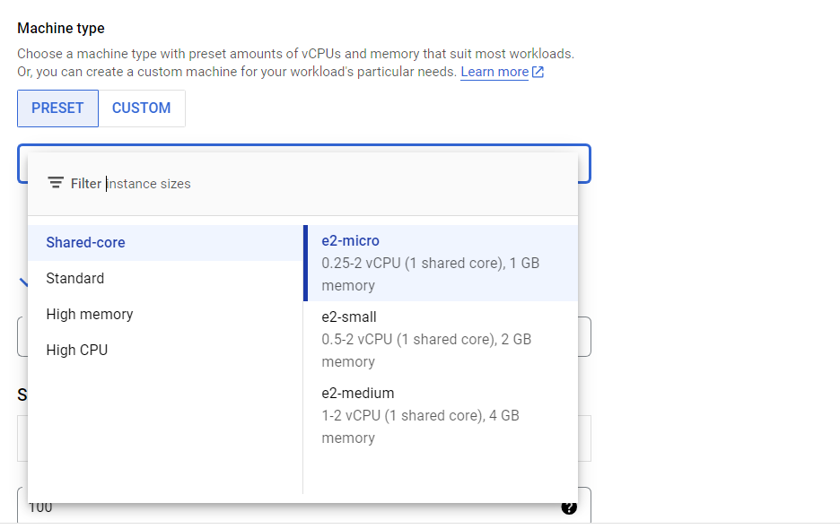

# how to start this project: section05-ticketing

### TODO:

0. docker login

- make sure docker is loggedin

1. start docker desktop (ensure docker + kubernetes started)

- NOTE: docker logged-in

2. ensure correct kubernetes context selected
   - right click docker-desktop app, select kubernetes context

- NOTE: gcloud project has already been created
- NOTE: gcloud kubernetes context already created (see readme)
- NOTE: you already have a gcloud project id (configured in infra/k8s/ yaml files)

### 122. kubernetes cluster creation

3. kubernetes engine -> clusters -> switch to standard -> config -> create

- config: zonal -> asia-east1-a (pick whats closest)
- node pools -> nodes -> machine family: `(E2) (E2 is Low cost, day-to-day computing)` -> machine type: `shared core (e2-micro)` -> bootdisk size (83gb)

  - NOTE: for the course Stephen chooses -> N1-> g1-small : `N1	Balanced price & performance	0.5 - 96	1.7 - 624 GB	Intel Skylake`
  - clusters -> default pool -> size -> number of `nodes -> 3`
    -NOTE: also try use `nodes -> 1` and `turn OFF auto-scaling`

- machine configuration  
  

- machine type  
  

4. login gcloud

NOTE: you have downloaded gcloud and installed gcloud cli -> `GoogleCloudSDKInstaller.exe`

- ensure this is the correct google account...

```
gcloud container clusters get-credentials ticketing-dev

```

gcloud auth application-default login

5. ensure cluster-admin permissions

```
kubectl create clusterrolebinding cluster-admin-binding --clusterrole cluster-admin --user $(gcloud config get-value account)

```

6. create ingres-controller/ load balancer (use code)

- with code:

```cmd
kubectl apply -f https://raw.githubusercontent.com/kubernetes/ingress-nginx/controller-v1.12.0-beta.0/deploy/static/provider/cloud/deploy.yaml
```

- NOTE: once the kubernetes load balancer is created, you need to get the ip. this ip must be put in the host file (windows/system32/drivers/etc/host):
  - eg. 134.44.32.54 ticketing.dev (which means if you visit `ticketing.dev`, direct traffic to the load balancer)
- NOTE: deleting is `kubectl delete -f https://raw.githubusercontent.com/kubernetes/ingress-nginx/controller-v1.12.0-beta.0/deploy/static/provider/cloud/deploy.yaml`

7.  ensure loadbalancer created

```cmd
gcloud console -> view all products -> networking -> network services -> load balancer
```

8. get load balancer ip

- [check load balancer](https://console.cloud.google.com/net-services/loadbalancing/)


9. paste in host (save as administrator)

- redirect url ticketing.dev to loadbalancer ip eg `34.80.20.175`

- c:\Windows\System32\drivers\etc\hosts

eg.

```
34.80.20.175 ticketing.dev
```

#### REQUIRED -> ADD SECRET (env variables)

- see notes 179. creating and accessing secrets

```
kubectl create secret generic jwt-secret --from-literal=JWT_KEY=asdf
```

10. creating and accessing secrets for pods (JWT signing key)

- NOTE: everytime you start up kubernetes kluster, if you used imperative approach for creating secrets, you have to initialize the create secret commands again in the commandline.

11. start skaffold

- from project folder: `section05-ticketing/`

```cmd
skaffold dev
```

12. test by visiting:

- NOTE: SSL certificate error `Your connection is not private`
- FIX: click on browser page and type 'thisisunsafe' -> hi there

```
https://ticketing.dev/api/users/currentuser
```

--------------------------------------------------------------
## Running Tickets/ app
- search main README.md for 
`TERMINAL WINDOW 1`
`TERMINAL WINDOW 2`
`TERMINAL WINDOW 3`
`TERMINAL WINDOW 4`

`### 298. Port-Forwarding with Kubectl` -> `# STEPS TO PUBLISHING`


---------------------------------------------------------------

#### TROUBLESHOOT

##### deleting nginx ingress controller

```ts
kubectl delete -f https://raw.githubusercontent.com/kubernetes/ingress-nginx/controller-v1.12.0-beta.0/deploy/static/provider/cloud/deploy.yaml
```

#### TROUBLESHOOT

- Error from server (InternalError): error when creating "STDIN": Internal error occurred: failed calling webhook "validate.nginx.ingress.kubernetes.io": failed to call webhook: Post "https://ingress-nginx-controller-admission.ingress-nginx.svc:443/networking/v1/ingresses?timeout=10s": no endpoints available for service "ingress-nginx-controller-admission"

- try delete Admission Controller that's complaining

```ts
kubectl delete -A ValidatingWebhookConfiguration ingress-nginx-admission

kubectl delete ingress -n default ingress-service
kubectl get ingress -A

```

##### delete individual components

```cmd
kubectl delete deployment ingress-nginx-controller --namespace=ingress-nginx
kubectl delete service ingress-nginx-controller --namespace=ingress-nginx
```

- NOTE: if you delete the load balancer (but no the cluster), running the `create ingres-controller/ load balancer` command doesnt re-create the loadbalancer as the controller still exists.
- FIX: by deleting and starting again

#### TROUBLESHOOT - skaffold not updating

- if you do `git commit --amend` this actually doesnt update the git repository, it uses the same commit id used last to ammend changes, this may have an effect on change detection
- change detection in tools like Docker, Skaffold:

##### Docker

- When you're building Docker images, the tool typically looks at the git repository to detect changes by considering the commit hash or timestamps of files. If you amend a commit but the commit hash remains the same, Docker might not detect a change because it's looking for a new commit hash or changes in file states, not just content modifications.
- In this case, Docker may not trigger a rebuild if the commit hash hasn’t changed. To trigger a rebuild, you would need to have a new commit hash that reflects the new state of your code.

##### Skaffold

- Skaffold monitors the changes in your project and can rebuild containers or redeploy applications based on changes in the git repository (among other things). If you amend a commit but the commit hash remains unchanged, Skaffold might not detect the change unless you force it to do so (by, for example, pushing the amended commit to a remote repository, which would trigger a new commit hash).

## REQUIRED STEP!

##### gcloud

##### google cloud dashboard

- [google cloud dashboard](https://console.cloud.google.com/apis/dashboard?pli=1)

##### shutting down

- from gcloud console -> shutdown kubernetes cluster (this costs money to keep running)
